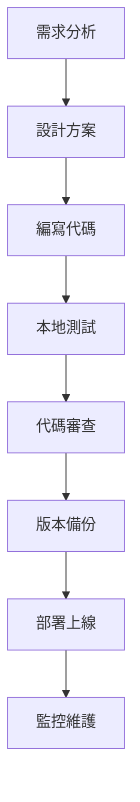

# 開發者指南 - 潘朵拉日常工作清單

## 👨‍💻 開發環境設定

### 必要工具
- **Git** - 版本控制
- **現代瀏覽器** - Chrome, Firefox, Edge, Safari
- **文字編輯器** - VS Code, Sublime Text, Atom
- **Windows 系統** - 執行 Batch 腳本

### 開發環境安裝
```bash
# 1. 安裝 Git
# 下載並安裝 Git for Windows
# https://git-scm.com/download/win

# 2. 設定 Git 用戶資訊
git config --global user.name "您的姓名"
git config --global user.email "您的信箱"

# 3. 克隆專案
git clone <repository-url>
cd 冠軍機用網頁
```

## 🏗️ 專案結構詳解

### 前端架構
```
前端層
├── HTML 結構 (index.html)
│   ├── 語義化標記
│   ├── 無障礙設計
│   └── SEO 優化
├── CSS 樣式 (style.css)
│   ├── 響應式設計
│   ├── 組件化樣式
│   └── 動畫效果
└── JavaScript 功能 (script.js)
    ├── 模組化設計
    ├── 事件處理
    └── API 整合
```

### 後端管理架構
```
管理層
├── Batch 腳本 (通用github管理工具.bat)
│   ├── Git 操作
│   ├── 檔案管理
│   └── 錯誤處理
├── 版本控制
│   ├── 本地 Git 倉庫
│   ├── GitHub 遠端倉庫
│   └── 分支管理
└── 備份系統
    ├── 自動備份
    ├── 版本備份
    └── 恢復機制
```

## 🔧 開發工作流程

### 1. 功能開發流程


### 2. 代碼提交規範
```bash
# 提交訊息格式
git commit -m "類型: 簡短描述"

# 類型說明
feat:     新功能
fix:      修復問題
docs:     文檔更新
style:    代碼格式
refactor: 重構代碼
test:     測試相關
chore:    構建過程或輔助工具的變動
```

### 3. 版本發布流程
```bash
# 1. 創建版本備份
通用github管理工具.bat
# 選擇選項 4 - 建立版本備份

# 2. 測試新版本
# 在本地測試所有功能

# 3. 部署上線
# 選擇選項 2 - 部署指定版本

# 4. 驗證部署
# 檢查線上版本是否正常
```

## 📝 代碼規範

### HTML 規範
```html
<!-- 語義化標記 -->
<header class="header">
    <h1><i class="fas fa-tasks"></i> 標題</h1>
</header>

<main class="main-content">
    <section class="daily-tools">
        <h2><i class="fas fa-tools"></i> 工具區域</h2>
        <div class="tools-grid">
            <!-- 工具項目 -->
        </div>
    </section>
</main>

<!-- 無障礙設計 -->
<button class="copy-btn" 
        data-copy="連結內容"
        aria-label="複製連結">
    <i class="fas fa-copy"></i>
</button>
```

### CSS 規範
```css
/* 使用 CSS 變數 */
:root {
    --primary-color: #007bff;
    --secondary-color: #6c757d;
    --border-radius: 8px;
    --box-shadow: 0 2px 4px rgba(0,0,0,0.1);
}

/* 組件化樣式 */
.tool-item {
    /* 基礎樣式 */
    background: var(--light-color);
    border-radius: var(--border-radius);
    box-shadow: var(--box-shadow);
    
    /* 響應式設計 */
    @media (max-width: 768px) {
        /* 手機版樣式 */
    }
}

/* BEM 命名規範 */
.tool-item__icon { }
.tool-item__content { }
.tool-item__action { }
.tool-item--active { }
```

### JavaScript 規範
```javascript
// 模組化設計
const App = {
    // 私有變數
    _config: {
        copyTimeout: 2000,
        animationDuration: 300
    },
    
    // 公開方法
    init() {
        this.updateCurrentDate();
        this.initializeEventListeners();
    },
    
    // 工具方法
    updateCurrentDate() {
        const now = new Date();
        const options = { 
            year: 'numeric', 
            month: 'long', 
            day: 'numeric',
            weekday: 'long'
        };
        const dateString = now.toLocaleDateString('zh-TW', options);
        document.getElementById('current-date').textContent = dateString;
    },
    
    // 事件處理
    initializeEventListeners() {
        const copyButtons = document.querySelectorAll('.copy-btn');
        copyButtons.forEach(btn => {
            btn.addEventListener('click', (e) => {
                this.handleCopyClick(e);
            });
        });
    },
    
    // 複製功能
    handleCopyClick(event) {
        event.preventDefault();
        const textToCopy = event.currentTarget.getAttribute('data-copy');
        this.copyToClipboard(textToCopy);
    },
    
    // 複製到剪貼板
    async copyToClipboard(text) {
        try {
            await navigator.clipboard.writeText(text);
            this.showCopySuccess();
        } catch (err) {
            this.fallbackCopyTextToClipboard(text);
        }
    }
};

// 頁面載入時初始化
document.addEventListener('DOMContentLoaded', () => App.init());
```

## 🧪 測試指南

### 1. 功能測試
```javascript
// 測試複製功能
function testCopyFunction() {
    const copyBtn = document.querySelector('.copy-btn');
    const testText = 'https://example.com';
    
    copyBtn.setAttribute('data-copy', testText);
    copyBtn.click();
    
    // 驗證剪貼板內容
    navigator.clipboard.readText().then(text => {
        console.assert(text === testText, '複製功能測試失敗');
    });
}

// 測試響應式設計
function testResponsiveDesign() {
    const viewports = [
        { width: 1920, height: 1080, name: '桌面版' },
        { width: 768, height: 1024, name: '平板版' },
        { width: 375, height: 667, name: '手機版' }
    ];
    
    viewports.forEach(viewport => {
        // 設定視窗大小
        window.resizeTo(viewport.width, viewport.height);
        
        // 檢查佈局
        const container = document.querySelector('.container');
        const computedStyle = window.getComputedStyle(container);
        
        console.log(`${viewport.name}: ${computedStyle.maxWidth}`);
    });
}
```

### 2. 兼容性測試
```javascript
// 檢查瀏覽器支援
function checkBrowserSupport() {
    const features = {
        clipboard: 'clipboard' in navigator,
        grid: CSS.supports('display', 'grid'),
        customProperties: CSS.supports('--custom-property', 'value'),
        fetch: 'fetch' in window
    };
    
    console.log('瀏覽器功能支援:', features);
    
    // 不支援的功能提供降級方案
    if (!features.clipboard) {
        console.warn('不支援 Clipboard API，使用降級方案');
    }
}
```

### 3. 性能測試
```javascript
// 頁面載入性能
function measurePageLoad() {
    window.addEventListener('load', () => {
        const perfData = performance.getEntriesByType('navigation')[0];
        console.log('頁面載入時間:', perfData.loadEventEnd - perfData.loadEventStart);
        console.log('DOM 解析時間:', perfData.domContentLoadedEventEnd - perfData.domContentLoadedEventStart);
    });
}

// 記憶體使用監控
function monitorMemoryUsage() {
    if ('memory' in performance) {
        const memory = performance.memory;
        console.log('記憶體使用:', {
            used: Math.round(memory.usedJSHeapSize / 1024 / 1024) + ' MB',
            total: Math.round(memory.totalJSHeapSize / 1024 / 1024) + ' MB',
            limit: Math.round(memory.jsHeapSizeLimit / 1024 / 1024) + ' MB'
        });
    }
}
```

## 🔧 除錯指南

### 1. 常見問題診斷
```javascript
// 檢查 Git 狀態
function checkGitStatus() {
    // 在管理工具中執行
    // git status
    // git remote -v
    // git log --oneline -5
}

// 檢查網路連接
function checkNetworkConnection() {
    fetch('https://api.github.com')
        .then(response => {
            if (response.ok) {
                console.log('GitHub API 連接正常');
            } else {
                console.error('GitHub API 連接失敗:', response.status);
            }
        })
        .catch(error => {
            console.error('網路連接錯誤:', error);
        });
}

// 檢查認證狀態
function checkAuthStatus() {
    // 在管理工具中執行
    // git config --get user.name
    // git config --get user.email
    // git ls-remote origin
}
```

### 2. 錯誤日誌
```javascript
// 錯誤日誌記錄
function logError(error, context) {
    const errorLog = {
        timestamp: new Date().toISOString(),
        error: error.message,
        stack: error.stack,
        context: context,
        userAgent: navigator.userAgent,
        url: window.location.href
    };
    
    console.error('錯誤日誌:', errorLog);
    
    // 可以發送到錯誤收集服務
    // sendErrorToService(errorLog);
}

// 全域錯誤處理
window.addEventListener('error', (event) => {
    logError(event.error, {
        type: 'JavaScript Error',
        filename: event.filename,
        lineno: event.lineno,
        colno: event.colno
    });
});

window.addEventListener('unhandledrejection', (event) => {
    logError(new Error(event.reason), {
        type: 'Unhandled Promise Rejection'
    });
});
```

## 🚀 部署指南

### 1. 本地部署
```bash
# 開發環境
git clone <repository-url>
cd 冠軍機用網頁
# 開啟 index.html 進行開發

# 測試環境
# 使用管理工具創建測試版本
通用github管理工具.bat
# 選擇選項 4 - 建立版本備份
```

### 2. 生產部署
```bash
# 1. 準備部署
git add .
git commit -m "feat: 準備生產部署"

# 2. 創建版本備份
# 使用管理工具創建版本備份

# 3. 部署到 GitHub Pages
# 使用管理工具選擇選項 2 - 部署指定版本

# 4. 驗證部署
# 檢查 GitHub Pages 是否正常顯示
```

### 3. 自動化部署
```bash
# 可以考慮使用 GitHub Actions 進行自動化部署
# 創建 .github/workflows/deploy.yml
name: Deploy to GitHub Pages
on:
  push:
    branches: [ main ]
jobs:
  deploy:
    runs-on: ubuntu-latest
    steps:
    - uses: actions/checkout@v2
    - name: Deploy to GitHub Pages
      uses: peaceiris/actions-gh-pages@v3
      with:
        github_token: ${{ secrets.GITHUB_TOKEN }}
        publish_dir: ./
```

## 📊 性能優化

### 1. 前端優化
```javascript
// 圖片懶加載
function lazyLoadImages() {
    const images = document.querySelectorAll('img[data-src]');
    const imageObserver = new IntersectionObserver((entries, observer) => {
        entries.forEach(entry => {
            if (entry.isIntersecting) {
                const img = entry.target;
                img.src = img.dataset.src;
                img.classList.remove('lazy');
                imageObserver.unobserve(img);
            }
        });
    });
    
    images.forEach(img => imageObserver.observe(img));
}

// 防抖處理
function debounce(func, wait) {
    let timeout;
    return function executedFunction(...args) {
        const later = () => {
            clearTimeout(timeout);
            func(...args);
        };
        clearTimeout(timeout);
        timeout = setTimeout(later, wait);
    };
}

// 使用防抖優化搜尋功能
const debouncedSearch = debounce((query) => {
    // 搜尋邏輯
}, 300);
```

### 2. 快取策略
```javascript
// 本地存儲快取
const Cache = {
    set(key, value, expiry = 3600000) { // 預設 1 小時過期
        const item = {
            value: value,
            expiry: Date.now() + expiry
        };
        localStorage.setItem(key, JSON.stringify(item));
    },
    
    get(key) {
        const item = localStorage.getItem(key);
        if (!item) return null;
        
        const parsed = JSON.parse(item);
        if (Date.now() > parsed.expiry) {
            localStorage.removeItem(key);
            return null;
        }
        
        return parsed.value;
    }
};

// 使用快取
const cachedData = Cache.get('toolData');
if (cachedData) {
    // 使用快取資料
} else {
    // 載入新資料並快取
    loadToolData().then(data => {
        Cache.set('toolData', data);
    });
}
```

## 🔒 安全最佳實踐

### 1. 輸入驗證
```javascript
// 驗證 URL 格式
function validateURL(url) {
    try {
        new URL(url);
        return true;
    } catch {
        return false;
    }
}

// 清理 HTML 內容
function sanitizeHTML(str) {
    const temp = document.createElement('div');
    temp.textContent = str;
    return temp.innerHTML;
}
```

### 2. 權限控制
```javascript
// 檢查剪貼板權限
async function checkClipboardPermission() {
    try {
        const permission = await navigator.permissions.query({name: 'clipboard-write'});
        return permission.state === 'granted';
    } catch {
        return false;
    }
}
```

## 📈 監控和分析

### 1. 用戶行為分析
```javascript
// 追蹤用戶操作
function trackUserAction(action, data) {
    // 可以整合 Google Analytics 或其他分析工具
    if (typeof gtag !== 'undefined') {
        gtag('event', action, data);
    }
    
    // 本地日誌
    console.log('用戶操作:', action, data);
}

// 追蹤工具點擊
document.addEventListener('click', (e) => {
    if (e.target.closest('.tool-item')) {
        const toolName = e.target.closest('.tool-item').querySelector('h3').textContent;
        trackUserAction('tool_click', { tool: toolName });
    }
});
```

### 2. 性能監控
```javascript
// 監控頁面性能
function monitorPerformance() {
    // 監控 Core Web Vitals
    if ('web-vitals' in window) {
        import('web-vitals').then(({ getCLS, getFID, getFCP, getLCP, getTTFB }) => {
            getCLS(console.log);
            getFID(console.log);
            getFCP(console.log);
            getLCP(console.log);
            getTTFB(console.log);
        });
    }
}
```

---

**開發者指南版本**: v1.0  
**適用版本**: v1.3+  
**最後更新**: 2025年9月19日  
**維護者**: AI 助手
